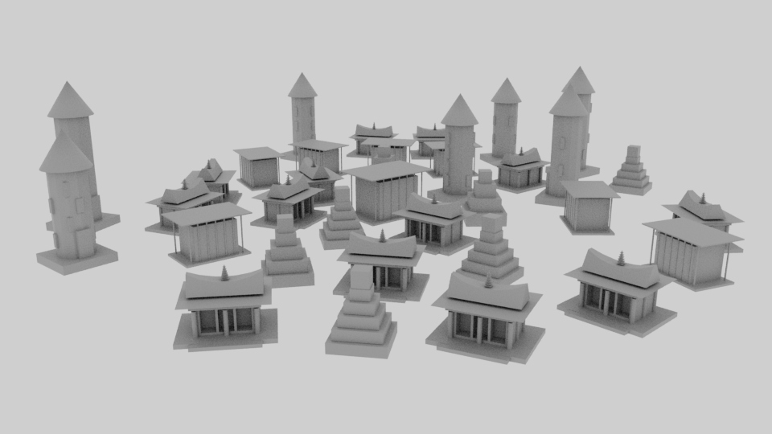

# Génération Procédurale Aléatoire d’une Ville de Temples – Python Maya
Ce projet est un TP réalisé dans le cadre du cours de Python Maya.
Il génère automatiquement une ville de temples de façon procédurale et aléatoire dans Autodesk Maya.

Le script crée plusieurs types de structures :
- temples mayas
- temples grecs
- temples bouddhistes
- tours cylindriques
Chaque temple est généré avec des variations aléatoires, puis disposé en cercles autour d’un temple central, tout en évitant les collisions.

# Aperçu

# Utilisation

- Ouvrir Autodesk Maya
- Charger le script dans le Script Editor
- Exécuter
Une ville complète se génère automatiquement dans la scène

# Fonctionnalités principales

Génération entièrement procédurale et aléatoire,
Plusieurs styles architecturaux,
Placement intelligent pour éviter les chevauchements,
Organisation en anneaux autour d’un temple central,
Possibilité de fusionner la ville en un seul objet.

# Auteur

Dounia Hullot
Étudiante en Arts et Technologies de l’Image (ATI – Paris 8)
TP réalisé dans le cadre du cours Python Maya.
